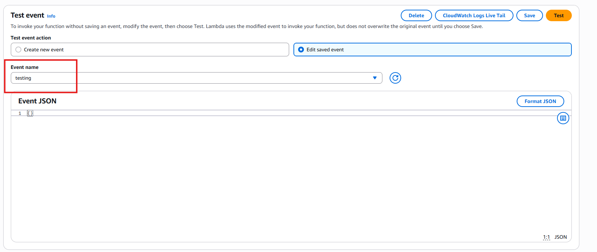
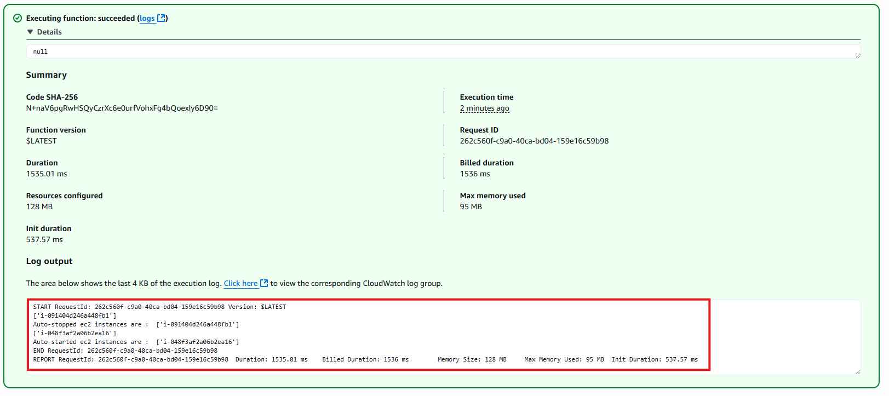
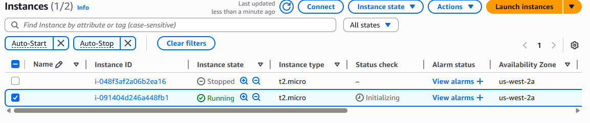
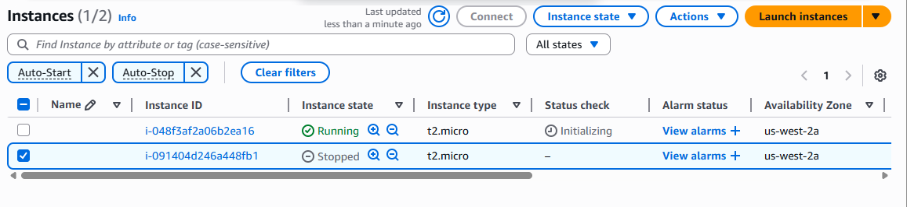

# 🖥️ Assignment 1: EC2 Instance Automation using AWS Lambda & Boto3

## 📘 Objective

Automatically **start or stop EC2 instances** based on tags using a Python-based AWS Lambda function and Boto3.

---

## 🛠️ Tech Stack

- **AWS Lambda**  
- **Python 3.13 + Boto3 SDK**  
- **EC2 (t2.micro instances)**  
- **IAM Roles**  
- **Manual Lambda Invocation**

---

## 🔨 Steps Followed

### ✅ 1. EC2 Instance Setup
- Launched **two t2.micro EC2 instances**
  - Instance 1: tagged with `Action = Auto-Stop`
  - Instance 2: tagged with `Action = Auto-Start`

### ✅ 2. IAM Role Setup
- Created a new IAM role: `kushal_lambda_ec2_manager`
- Attached policy: `AmazonEC2FullAccess`
- Assigned this role to the Lambda function

### ✅ 3. Lambda Function Creation
- Created a new Lambda function named `Kushal_manage_ec2_by_tag_action`
- Used **Python 3.13** runtime
- Wrote a script using `boto3` to:
  - Stop EC2 instances with tag `Auto-Stop`
  - Start EC2 instances with tag `Auto-Start`

📸 *Screenshot: Lambda Function Code*

  

### ✅ 4. Test Event Configuration
- Created a test event with empty JSON `{}` to manually invoke the Lambda function.

📸 *Screenshot: Test Event Configuration*

  

### ✅ 5. Execution & Logs
- Manually ran the Lambda function
- Logs confirmed:
  - EC2 instance with `Auto-Stop` tag was stopped
  - EC2 instance with `Auto-Start` tag was started

📸 *Screenshot: Lambda Execution Logs*

  

### ✅ 6. EC2 State Change Verification
- Opened EC2 dashboard to verify:
  - `Auto-Start` instance is now running
  - `Auto-Stop` instance is now stopped

📸 *Screenshot: EC2 State Before Running Function*

  

 

📸 *Screenshot: EC2 State After Running Function*

  

---

## 📁 Files Included

| File Name             | Description                                |
|----------------------|--------------------------------------------|
| `lambda_function.py` | Boto3-based Lambda function code            |
| `README.md`          | This documentation                         |
| `/screenshots/*`     | Visual proof for each task step            |

---

## 👤 Author

- **U KUSHAL RAO**
- GitHub: [@kushal1997](https://github.com/kushal1997)

---

## 🚀 How to Reproduce This

1. Launch 2 EC2 instances with tags `Action: Auto-Start` and `Action: Auto-Stop`
2. Create a Lambda with `AmazonEC2FullAccess` IAM role
3. Paste the provided code and deploy
4. Create a test event and execute
5. Observe EC2 instance state changes

---

 
