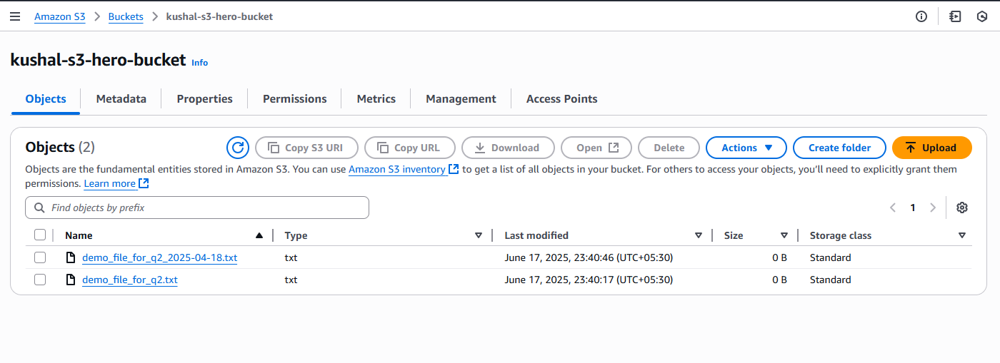
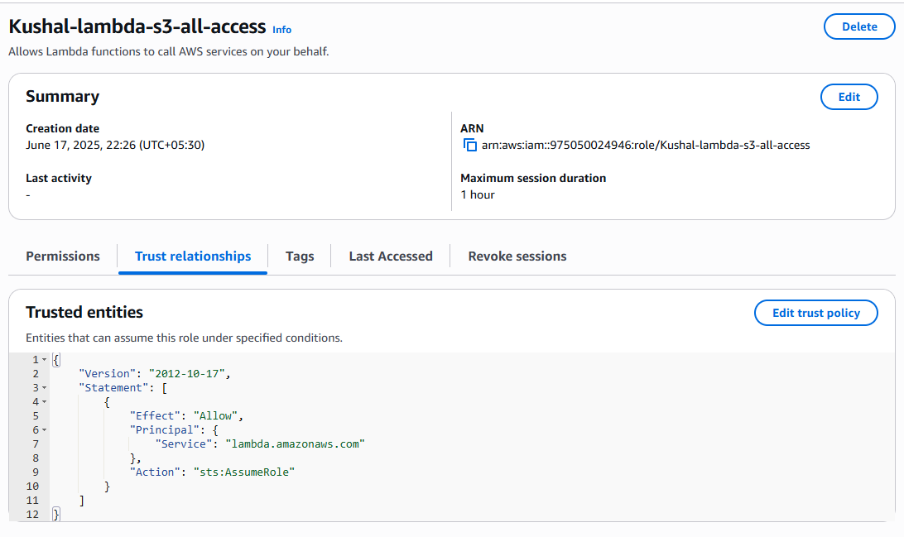
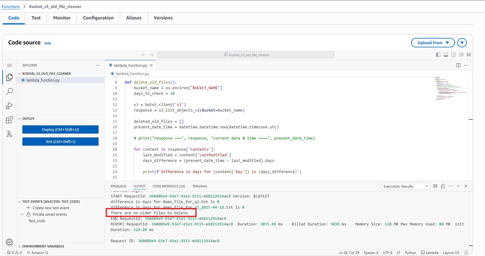
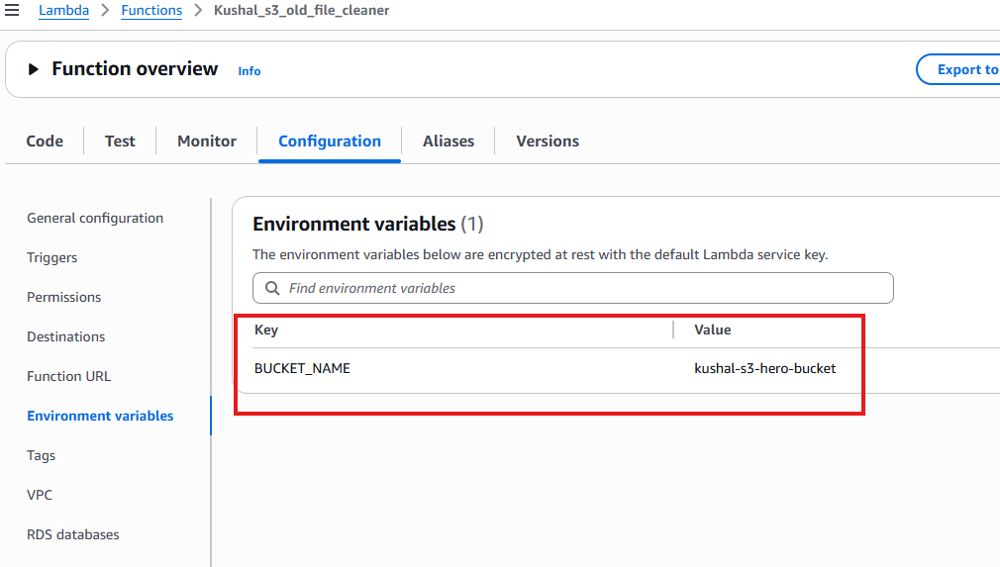
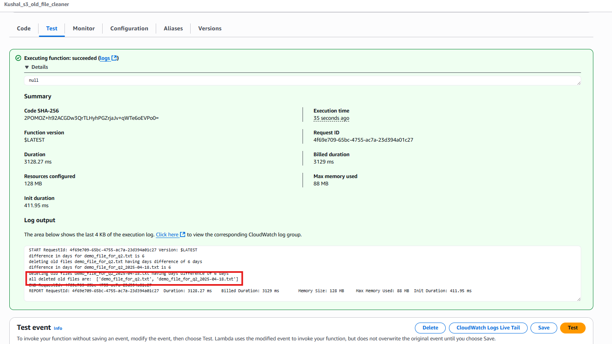
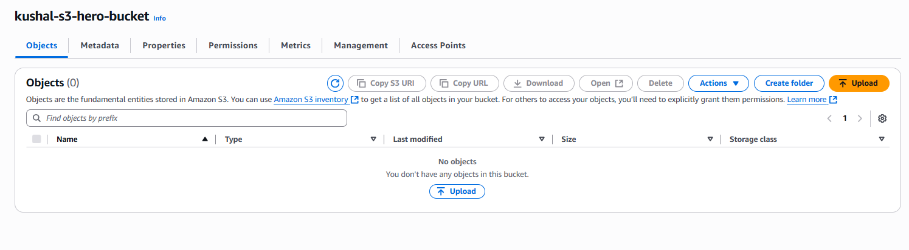

# 🖥️ Assignment 2: Automated S3 Bucket Cleanup Using AWS Lambda and Boto3

## 📘 Objective

This project is part of a graded DevOps assignment to demonstrate how to use AWS Lambda, IAM, and Boto3 to automate cleanup of old files in an S3 bucket.  
The Lambda function scans an S3 bucket and deletes all files older than **30 days**.

---

## 🛠️ Tech Stack

- **AWS Lambda**  
- **Python 3.13 + Boto3 SDK**  
- **S3**  
- **IAM Roles**  
- **Manual Lambda Invocation**

---

## 🔨 Steps Followed

### ✅ 1. S3 Bucket Setup
- Used a old bucket
- Uploaded a single test file with today’s date.
- Since uploading files older than 30 days wasn’t feasible directly, the **Lambda code was modified to use a `0-day` difference**, meaning:
  - **Any file older than or equal to 0 days** (i.e., not uploaded at the same moment) would be deleted.
- This allowed us to test the logic without manipulating timestamps.

📸 *Screenshot: S3 Bucket*
<p align="center">
  
</p>

### ✅ 2. IAM Role Setup
- Created a new IAM role: `Kushal-lambda-s3-all-access`
- Attached policy: `AmazonS3FullAccess`
- Assigned this role to the Lambda function

📸 *Screenshot: IAM Role Config*
<p align="center">
  
</p>

### ✅ 3. Lambda Function Creation
- Created a Lambda function named `Kushal_s3_old_file_cleaner` with Python 3.12 runtime.
- Added environment variable: `BUCKET_NAME` to store the S3 bucket name.
- Pasted the derived Python code using `boto3` to delete old files.


📸 *Screenshot: Lambda Function Code*
<p align="center">
  
</p>

<br>

📸 *Screenshot: ENV Config*
<p align="center">
  
</p>

### ✅ 4. Manual Test & Output Verification
- Manually triggered the Lambda function.
- Change the parameter of days to 4 to test out my code as:
    ```
      days_to_check = 4
    ```
- Verified the log to confirm that:
  - Only files older than `4 days` were deleted.
  - Recent files were retained.

📸 *Screenshot: Lambda Execution Log*
<p align="center">
  
</p>

📸 *Screenshot: S3 Bucket list after execution*
<p align="center">
  
</p>

---

## 📁 Files Included

| File Name             | Description                                |
|----------------------|--------------------------------------------|
| `lambda_function.py` | Boto3-based Lambda function code            |
| `README.md`          | This documentation                         |
| `/screenshots/*`     | Visual proof for each task step            |

---

## 👤 Author

- **U KUSHAL RAO**
- GitHub: [@kushal1997](https://github.com/kushal1997)

---

## 🚀 How to Reproduce This

1. Create a Lambda function with Python 3.x.
2. Assign an IAM Role with `AmazonS3FullAccess`.
3. Add environment variable:
   - `BUCKET_NAME = your-bucket-name`
4. Paste in the `lambda_function.py` code.
5. Upload sample files to your bucket.
6. Trigger function using “Test”.
7. Check Execution log

---

<br>
