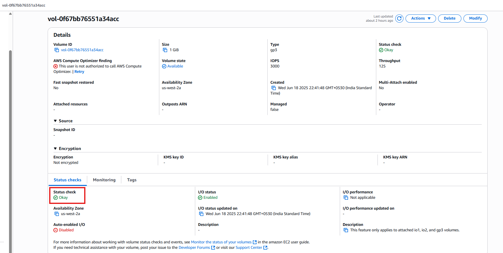
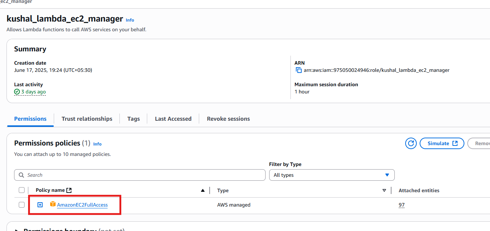
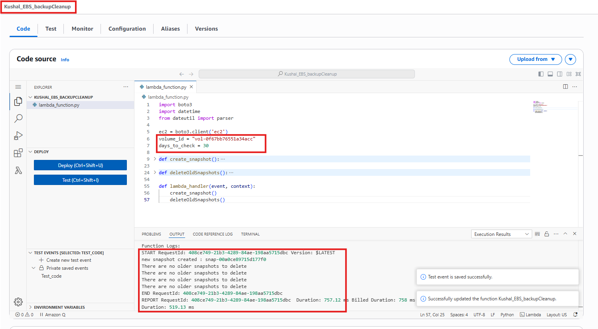
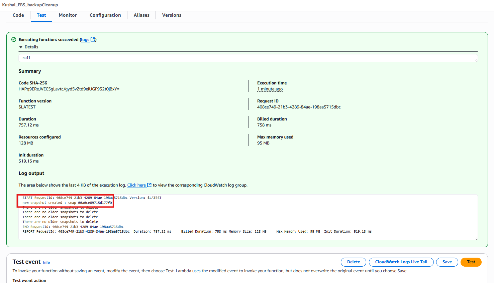
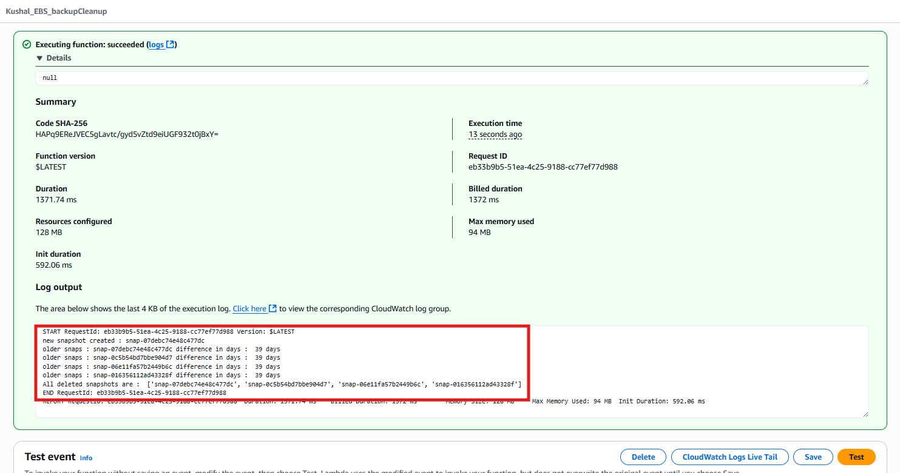
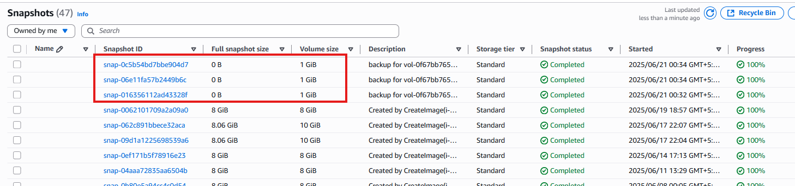
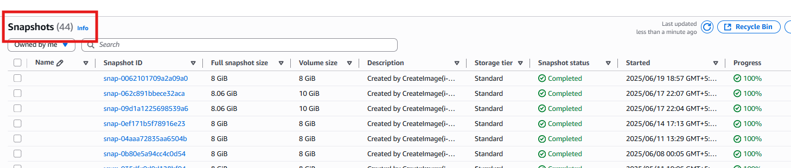
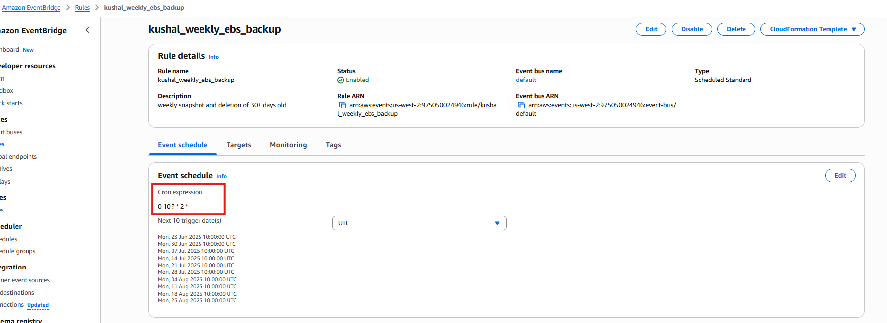

# 🖥️ Assignment 4: Automatic EBS Snapshot and Cleanup Using AWS Lambda and Boto3

### 📘 Objective

To automate the creation of EBS volume snapshots and delete snapshots older than 30 days using AWS Lambda, Boto3, and scheduled CloudWatch Events (via EventBridge).

---

## 🛠 Tech Stack

* **Language:** Python 3.x
* **AWS Services:** Lambda, IAM, EC2 (EBS), CloudWatch Events (EventBridge)
* **SDK:** Boto3

---

## 🔨 Steps Followed

### ✅  Step 1: EBS Setup

1. Navigated to EC2 Dashboard → Volumes.
2. Created a new 1 GiB `gp2` volume in a free-tier AZ (e.g., `us-west-2a`).
3. Copied the Volume ID (e.g., `vol-0abcd1234efgh5678`).

📸 **Screenshot**: 
<p align="center">
  
</p>

---

### ✅  Step 2: IAM Role Creation for Lambda

1. Opened IAM → Roles → Created a new role.
2. Trusted entity: AWS Service → Lambda.
3. Attached policy: `AmazonEC2FullAccess`.
4. Role name: `kushal_lambda_ec2_manager`

📸 **Screenshot**:
<p align="center">
  
</p>

---

### ✅  Step 3: Lambda Function Creation

1. Created a function named `Kushal_EBS_backupCleanup` in Lambda Console.
2. Selected Python 3.13 and used the IAM role from Step 2.
3. Pasted the Boto3 script to:

   * Create a snapshot for the volume.
   * Identify & delete snapshots older than 30 days.

📸 **Screenshot**:
<p align="center">
  
</p>

---

### ✅  Step 4: Manual Testing

1. Configured test event (`Test_code`) and executed the function.
2. Verified logs:

   * Snapshot created: `snap-xxxxxxx`
   * Older snapshots deleted with ID logs.
3. Confirmed snapshots in EC2 → Snapshots tab.

📸 **Screenshot**: 
- run orginal code -> craeted new snapshots
<p align="center">
  
</p>

<br>

- changed present date to test delition 
```
    from dateutil import parser

    present_date_time = "2025-07-22 17:58:58.706041+00:00"
    present_date_time = parser.parse(present_date_time)
```
<p align="center">
  
</p>

<br>

📸 **Screenshot**:
- showing list before testing
<p align="center">
  
</p>


<br>

- showing list after testing
<p align="center">
  
</p>
---

### ✅  Step 5: Scheduled Trigger Using CloudWatch Events (EventBridge)

1. Opened EventBridge → Created a rule `kushal_weekly_ebs_backup`.
2. Schedule: Every 1 week at 10 AM.
3. Target: `Kushal_EBS_backupCleanup` Lambda function.
4. Rule created successfully.

📸 **Screenshot**:
<p align="center">
  
</p>

---

## 🧾 Logging Sample

```bash
new snapshot created : snap-07debc74e48c477dc
older snaps : snap-07debc74e48c477dc difference in days :  39 days
```

---

## 📁 Files Included

| File Name             | Description                               |
|----------------------|--------------------------------------------|
| `lambda_function.py` | Boto3-based Lambda function code           |
| `README.md`          | This documentation                         |
| `/screenshots/*`     | Visual proof for each task step            |
| `requirements.txt`   | packages need to install to run this code  |


---


## 👤 Author

* **U KUSHAL RAO**
* GitHub: [@kushal1997](https://github.com/kushal1997)
* Email: [kushalrao103@gmail.com](mailto:kushalrao103@gmail.com)


---

## 🚀 How to Reproduce This

1. Create a new EBS volume in EC2 and note the volume ID.

2. Create an IAM role with AmazonEC2FullAccess and trust to Lambda.

3. Create a Lambda function with the provided code (update with your volume ID).

4. Test the function manually to validate snapshot creation and cleanup.

5. Schedule the function using EventBridge for weekly execution.

6. Install Python dependencies locally using:
```
pip install -r requirements.txt
```

---

<br>