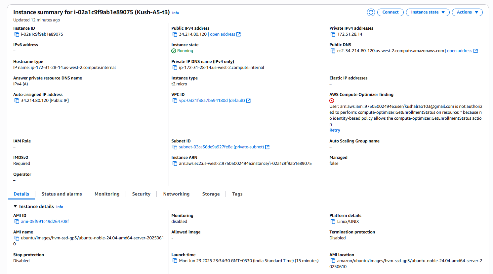
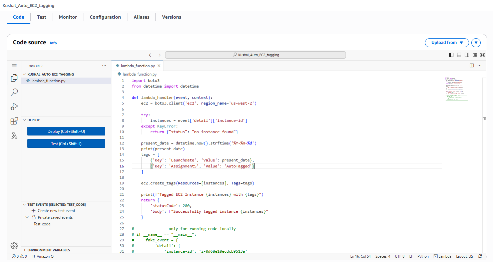
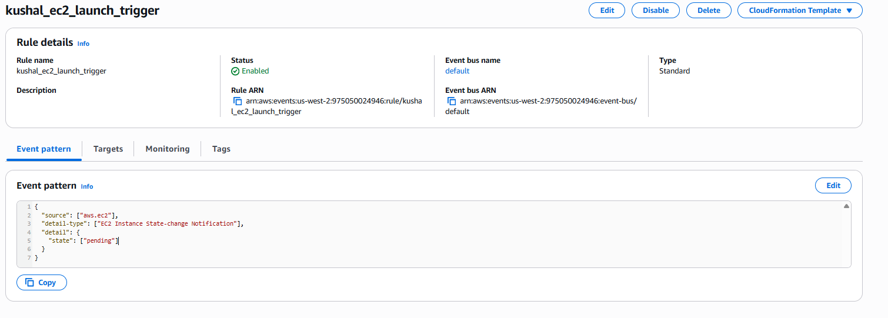
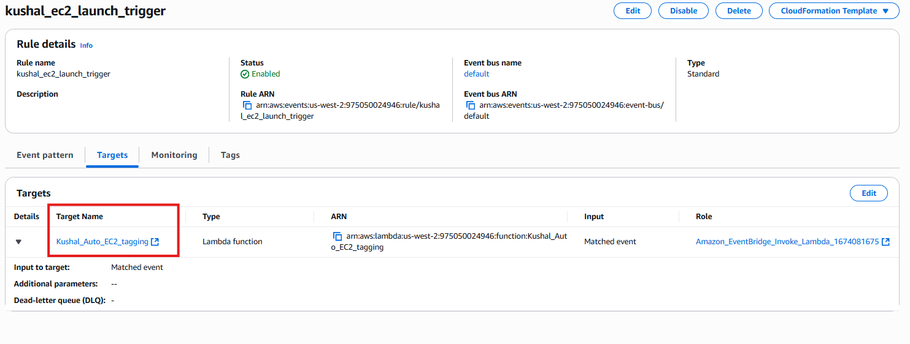
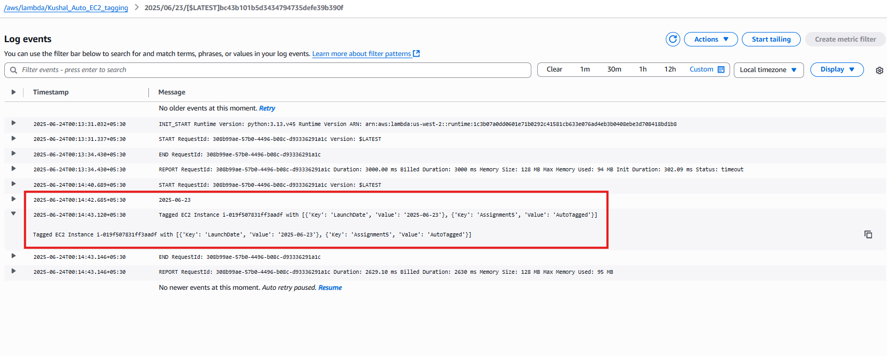
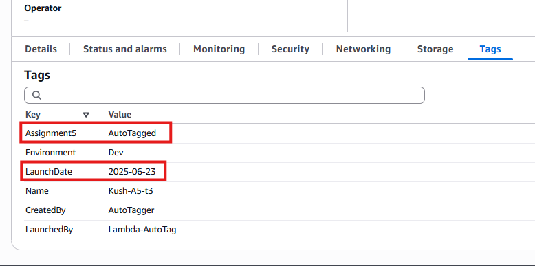

# 🖥️ Assignment 4: Automatic EBS Snapshot and Cleanup Using AWS Lambda and Boto3

### 📘 Objective

Automatically tag newly launched EC2 instances with metadata such as:
- `LaunchDate`: Derived from the event time
- `Custom-Tag`: Indicating automatic tagging

---

## 🛠 Tech Stack

- **Language**: Python 3.12
- **Cloud Provider**: AWS
- **Services Used**:
  - AWS Lambda
  - Amazon EC2
  - Amazon EventBridge (CloudWatch Events)
  - AWS IAM

---

## 🔨 Steps Followed

### ✅  Step 1: EC2 Instance Setup

1. Launched a t2.micro instance
2. Left the instance untagged to allow Lambda to apply tags

📸 **Screenshot**: 
<p align="center">
  
</p>

---

### ✅  Step 2: IAM Role Creation for Lambda

1. Opened IAM → Roles → Created a new role.
2. Trusted entity: AWS Service → Lambda.
3. Attached policy: 
    - `AmazonEC2FullAccess`
    - `AWSLambdaBasicExecutionRole`

4. Role name: `Kushal_lambda_ec2_tagging_role `

📸 **Screenshot**:
<p align="center">
  
</p>

---

### ✅  Step 3: Lambda Function Creation

1. Created a function named `Kushal_Auto_EC2_tagging` in Lambda Console.
2. Selected Python 3.13 and used the IAM role from Step 2.
3. Pasted the Boto3 script to create these keys & tag:
    ```
      {'Key': 'LaunchDate', 'Value': present_date},
      {'Key': 'Assignment5', 'Value': 'AutoTagged'}
    ```

📸 **Screenshot**:
<p align="center">
  
</p>

---

### ✅  Step 4: EventBridge Rule Configuration

1. Rule Name: `kushal_ec2_launch_trigger`
2. Triggered on EC2 instance state = `pending`
3. Target: `Kushal_Auto_EC2_tagging` Lambda function

📸 **Screenshot**: 
- Eventbridge rule:
<p align="center">
  
</p>

<br>

- Eventbridge Target:
<p align="center">
  
</p>


---

## 🧾 Logging Sample
- Lambda logs in CloudWatch confirmed instance ID and tagging
- Correct tag timestamps shown using event's original launch time

📸 **Screenshot**: 
- Cloudwatch Log:
<p align="center">
  
</p>

<br>

- Updated EC2 Tags:
<p align="center">
  
</p>
---

## 📁 Files Included

| File Name             | Description                               |
|----------------------|--------------------------------------------|
| `lambda_function.py` | Boto3-based Lambda function code           |
| `README.md`          | This documentation                         |
| `/screenshots/*`     | Visual proof for each task step            |
| `requirements.txt`   | packages need to install to run this code  |


---


## 👤 Author

* **U KUSHAL RAO**
* GitHub: [@kushal1997](https://github.com/kushal1997)
* Email: [kushalrao103@gmail.com](mailto:kushalrao103@gmail.com)


---

## 🚀 How to Reproduce This

1. Launch a new EC2 instance (e.g., t2.micro) without any tags.

2. Create an IAM role with `AmazonEC2FullAccess` and `AWSLambdaBasicExecutionRole`, trusted for Lambda.

3. Create a Lambda function with the provided Python code and assign the IAM role.

4. Set up an EventBridge rule to trigger the Lambda function on EC2 `pending` state.

5. Launch a new EC2 instance and verify tags are added automatically.

6. Install Python dependencies if want to run locally:
```
pip install -r requirements.txt
```

---

<br>