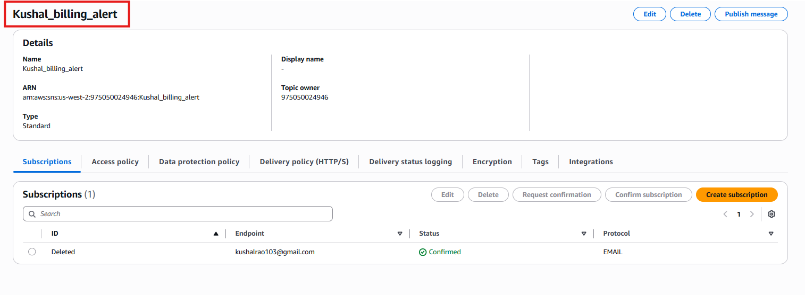
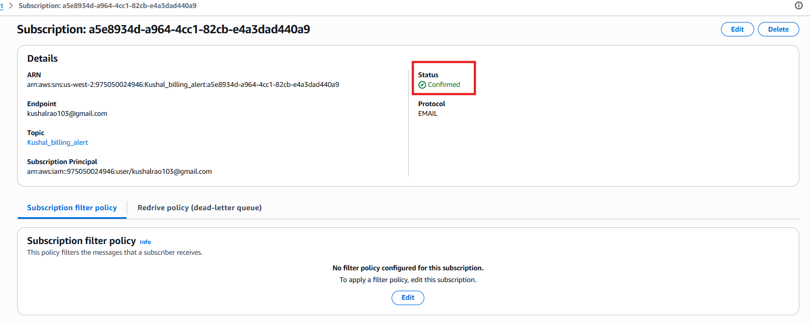
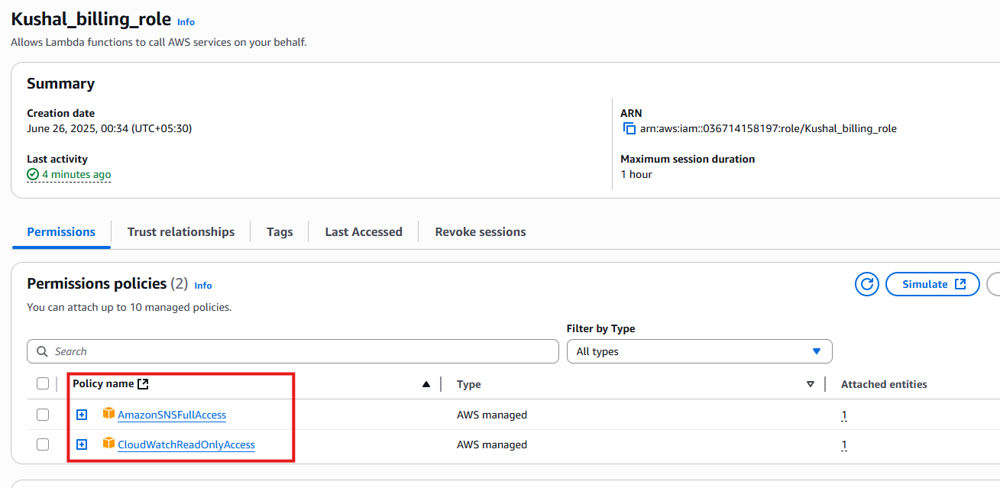
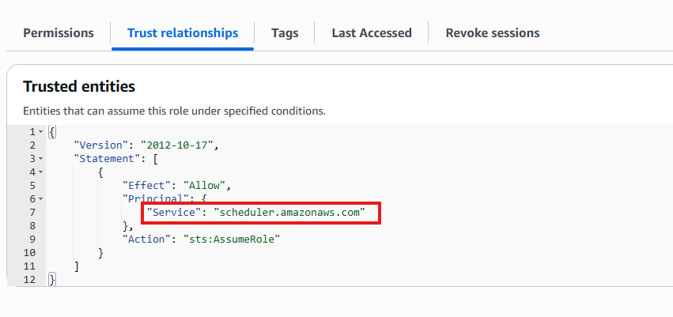
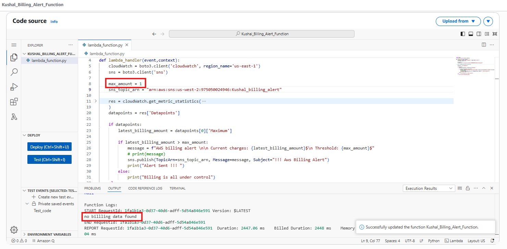
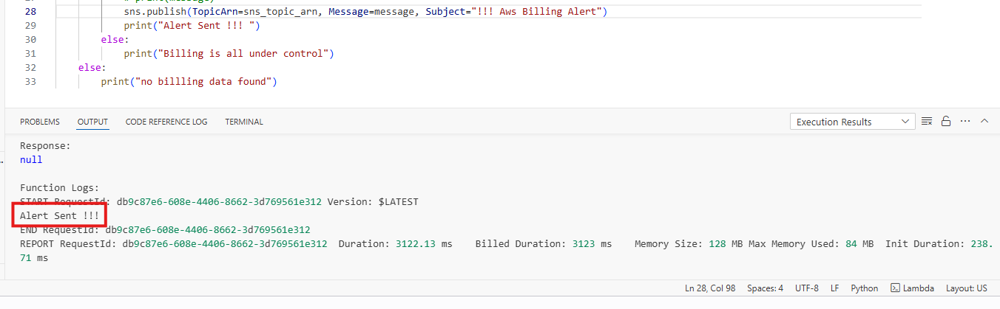
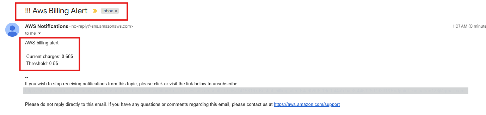
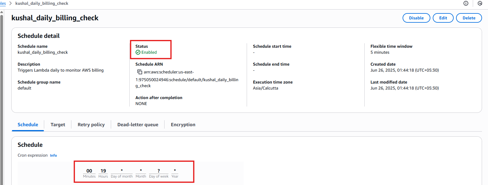
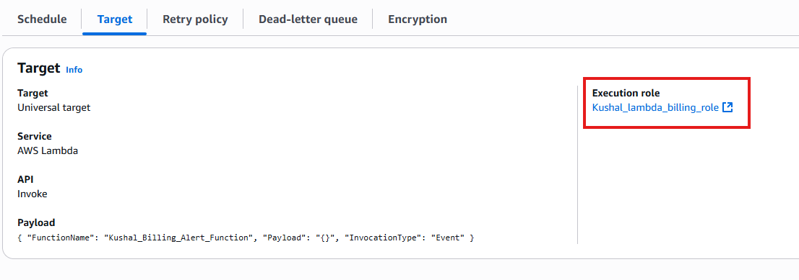

# 🖥️ Assignment 6: Monitor and Alert High AWS Billing

### 📘 Overview

This assignment demonstrates how to automate AWS billing alerts using **Lambda**, **CloudWatch**, **SNS**, and **EventBridge Scheduler**. The Lambda function checks daily AWS estimated charges and sends an email notification via SNS if the cost exceeds a predefined threshold.

---

## 🛠 Tech Stack

- **Language:** Python (Boto3)
- **Cloud Services:** AWS Lambda, SNS, EventBridge, IAM, CloudWatch
- **Trigger:** EventBridge Scheduled Rule
- **Alerting:** Email Notification

---


## ✅ Objective

Create an automated billing alert that sends an email if AWS estimated billing exceeds a set threshold (e.g., $50).

---

## 🔨 Steps Followed

### ✅  Step 1: SNS Topic and Email Subscription

1. Created an SNS topic named `Kushal_billing_alert`.
2. Subscribed email to the topic.
3. Confirmed the subscription via email.

📸 **Screenshot**: *SNS Topic Creation*
<p align="center">
  
</p>

<br>

📸 **Screenshot**: *SNS Email Subscription*
<p align="center">
  
</p>
---

### ✅  Step 2: IAM Role Creation for Lambda

1. Created a new IAM role for Lambda.
2. Attached policies:
   - `CloudWatchReadOnlyAccess`
   - `AmazonSNSFullAccess`
3. Edited trust relationship to allow `scheduler.amazonaws.com` to assume the role.
4. Role name: `Kushal_lambda_billing_role `

📸 **Screenshot**: *IAM Role with Permissions*
<p align="center">
  
</p>

<br>

📸 **Screenshot**: *IAM Role's True Relationship*
<p align="center">
  
</p>

---

### ✅  Step 3: Lambda Function Creation

1. Created Lambda function: `Kushal_Billing_Alert_Function`
2. Selected Python 3.12 and attached the IAM role.
3. Added Boto3 script to:
   - Retrieve billing metrics
   - Compare with threshold
   - Send email alert if exceeded

📸 **Screenshot**: *Lambda function code*
<p align="center">
  
</p>

---

### ✅  Step 4: Manual Test of Lambda Execution

1. Used **Test** feature in Lambda Console.
2. Verified logs and billing logic.
3. Received email if billing threshold was crossed.

> 📌 Note: Used my personal aws account to trigger EMAIL

📸 **Screenshot**: *Lambda Testing Output*
<p align="center">
  
</p>

<br>

📸 **Screenshot**: *Email Alert Received*
<p align="center">
  
</p>


---

### ✅ Step 5: EventBridge Rule for Daily Trigger

1. Opened EventBridge Scheduler and created a new schedule.
2. Set frequency: `rate(1 day)` (scheduled for 7 PM daily)
3. Target: Lambda function
4. Role: Reused IAM role from Step 2

📸 **Screenshot**: *EventBridge Daily Schedule*
<p align="center">
  
</p>

<br>

📸 **Screenshot**: *EventBridge Target Lambda*
<p align="center">
  
</p>

---

## 📁 Files Included

| File Name             | Description                               |
|----------------------|--------------------------------------------|
| `lambda_function.py` | Boto3-based Lambda function code           |
| `README.md`          | This documentation                         |
| `/screenshots/*`     | Visual proof for each task step            |
| `requirements.txt`   | packages need to install to run this code  |


---


## 👤 Author

* **U KUSHAL RAO**
* GitHub: [@kushal1997](https://github.com/kushal1997)
* Email: [kushalrao103@gmail.com](mailto:kushalrao103@gmail.com)


---

## 🚀 How to Reproduce This

1. Create an SNS topic and confirm email subscription.
2. Create an IAM role with the following:
   - `CloudWatchReadOnlyAccess`
   - `AmazonSNSFullAccess`
   - Trust policy for `scheduler.amazonaws.com`
3. Create Lambda function with billing-check logic and assign IAM role.
4. Test the function manually.
5. Schedule it using EventBridge to run daily.
6. Install local dependencies using:
```
pip install -r requirements.txt
```

---

<br>